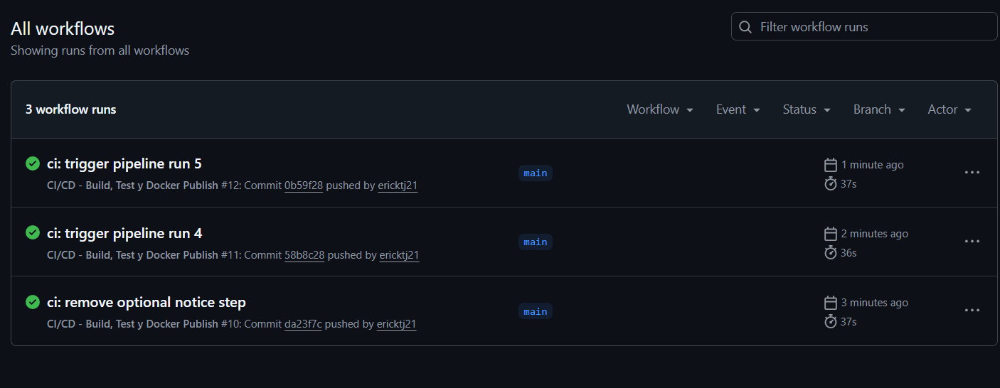
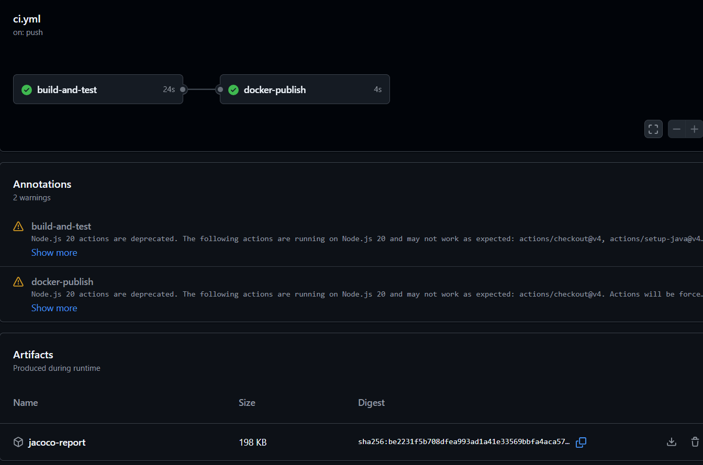
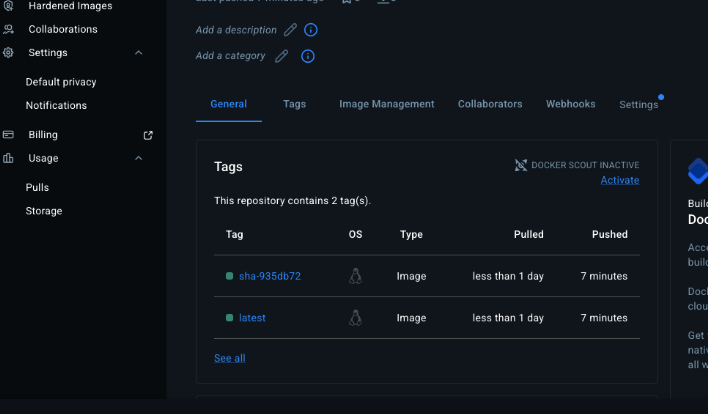

# U12 Post 2 - CI/CD con GitHub Actions y Docker Hub


## Requisitos
- Java 17
- Maven 3.9+
- Docker Hub (Access Token)

## Secrets requeridos
- DOCKERHUB_USERNAME
- DOCKERHUB_TOKEN

## Pipeline
1. Compilar y ejecutar pruebas con JaCoCo
2. Publicar reporte JaCoCo como artefacto
3. Construir imagen Docker multi-stage
4. Publicar imagen en Docker Hub con tags latest y sha-<commit>

## Imagen Docker
```bash
docker pull ericktj21/mi-spring-app:latest
```

## Evidencias
Historial de GitHub Actions con ejecuciones verdes


Artefacto JaCoCo descargado


Docker Hub con tags latest y sha

